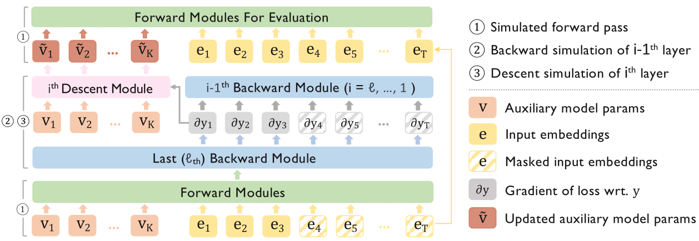

## TinT: Trainable Transformer in Transformer

This repository contains the code for our paper Trainable Transformer in Transformer (TinT).
 
## Quick Links

- [TinT: Trainable Transformer in Transformer](#tint-trainable-transformer-in-transformer)
- [Quick Links](#quick-links)
- [Overview](#overview)
  - [Structure of TinT](#structure-of-tint)    
- [Creating TinT](#creating-tint)
  - [Requirements](#requirements)
  - [Perplexity Evaluation](#perplexity-evaluation)
  - [Downstream Evaluation](#downstream-evaluation)
  - [Hyperparameter Considerations](#hyperparameter-considerations)
  - [Unavailable features](#unavailable-features)
- [Bugs or Questions](#bugs-or-questions)


## Overview

We propose an efficient construction, Transformer in Transformer (in short, TinT), that allows a transformer to simulate and fine-tune complex models internally during inference (e.g., pre-trained language models). In particular, we introduce  innovative approximation techniques that allow a TinT model with less than 2 billion parameters to simulate and fine-tune a 125 million parameter transformer model within a single forward pass. TinT accommodates many common transformer variants and its design ideas also improve the efficiency of past instantiations of simple models inside transformers. We conduct end-to-end experiments to validate the internal fine-tuning procedure of TinT on various language modeling and downstream tasks. For example, even with a limited one-step budget, we observe TinT for a OPT-125M model improves performance by 4-16% absolute on average compared to OPT-125M. These findings suggest that large pre-trained language models are capable of performing intricate subroutines. 

### Structure of TinT

Each Forward, Backward, and Descent module is represented using combinations of linear, self-attention, layernorm, and activation layers. The input consists of prefix embeddings, that represent relevant auxiliary model parameters in each layer, input token embeddings, and a binary prefix mask to separate the train and evaluation segments of the input. The auxiliary model parameters are updated in the descent module using the training part of the segment, and the updated prefix tokens are transferred to the forward modules via residual connections for evaluating the rest of the segment.
    



## Creating TinT

In the following section, we provide instructions on creating and evaluating TinT models with our code.

### Requirements
Install necessary conda environment using 

```bash
conda env create -n icl_as_ft --file icl_as_ft.yml
```

### Create and store TinT 

```bash
python -m tests.create_model \
--model_name_or_path $model_path \
--cache_dir $cache_dir \
--construct_model_path $model_path \
--n_simulation_layers $nsim_layers \
--n_forward_backward $n_forward_backward \
--inner_lr $lr \
--n_layers_pergpu $n_layers_pergpu \
--num_attention_heads $num_attention_heads \
--hidden_size $hidden_size \
--num_prefixes $num_prefixes \
--construct_save_model $construct_save_model \
--reuse_forward_blocks $reuse_forward_blocks \
--reuse_backward_blocks $reuse_backward_blocks \
--restrict_prefixes $restrict_prefixes;
```


* `model_path`: facebook/opt-125m or gpt2, Auxiliary model to create the TinT model
* `cache_dir`: Directory to store and load opt/gpt2 models
* `construct_save_model`: Whether to save the constructed model
* `construct_model_path`: Path to load or save the constructed model
* `n_simulation_layers`: Number of layers to update during dynamic evaluation
* `n_forward_backward`:  Number of SGD steps
* `num_attention_heads`:  Number of attention heads in constructed model
* `hidden_size`:  Embedding size of constructed model
* `num_prefixes`:  Number of prefix tokens
* `inner_lr`: Learning rate for dynamic evaluation; note that in our construction, gradients are summed over tokens (and not averaged)
* `n_layers_pergpu`: When using multiple gpus, partition layers, with n_layers_pergpu per gpu
* `reuse_forward_blocks`: True/False, For multi step SGD, reuse transformer blocks for simulating forward pass
* `reuse_backward_blocks`: True/False, For multi step SGD, reuse transformer blocks for simulating backward pass
* `restrict_prefixes`: For linear operations, we can decide the linear attention heads to only restrict to interactions between prefix tokens and input embeddings


An example to create a TinT model from auxiliary model gpt2 is as follows:

```bash
python -m tests.create_model \
--model_name_or_path gpt2 \
--cache_dir "cache/" \
--construct_model_path "Constructed_model/TinT_gpt2_innerlr04_ngradlayers12_sgdsteps1" \
--n_simulation_layers 12 \
--n_forward_backward 1 \
--inner_lr 1e-04 \
--n_layers_pergpu 36 \
--num_attention_heads 12 \
--hidden_size 3072 \
--num_prefixes 256 \
--construct_save_model True \
--reuse_forward_blocks True \
--reuse_backward_blocks True \
--restrict_prefixes True;
```


### Perplexity Evaluation
Use the following commandline to run perplexity evaluation on wikitext-2, wikitext-103, and c4.


```bash
python -m tests.perplexity_eval \
--dataset $dataset \
--model_name_or_path $model_path \
--cache_dir $cache_dir \
--construct_model_path $model_path \
--train_fraction $train_fraction  \
--batch_size $batch_size \
--use_eval_set $use_eval_set\
--use_test_set $use_test_set\
--data_subset $data_subset;
```

* `dataset`: c4/wikitext-2/wikitext-103
* `model_path`: facebook/opt-125m or gpt2, Auxiliary model used to create the TinT model
* `cache_dir`: Directory to store and load opt/gpt2 models
* `construct_model_path`: Path to load the constructed model
* `train_fraction`: Fraction of input to use for training (float between 0 and 1)!
* `batch_size`: Batch size for the forward passes
* `use_eval_set`: True/False, Use validation set?
* `use_test_set`: True/False, Use test set? (if both use_eval_set and use_test_set are True, test set is used for evaluation)
* `data_subset`: Evaluation on subset of data (must be a multiple of batch size).


The results are stored in a json format, with all the arguments, in a file named **log_exp_construct**. An example for perplexity evaluation of the TinT model "Constructed_model/TinT_gpt2_innerlr04_ngradlayers12_sgdsteps1" on wikitext-103 is as follows:

```bash
python -m tests.perplexity_eval \
--dataset wikitext-103 \
--model_name_or_path gpt2 \
--cache_dir "cache/" \
--construct_model_path "Constructed_model/TinT_gpt2_innerlr04_ngradlayers12_sgdsteps1" \
--train_fraction 0.5  \
--batch_size 4 \
--use_eval_set True\
--use_test_set False;
```


### Downstream Evaluation

Please refer to the README file in **icl_eval** folder.


### Hyperparameter considerations

Embedding size and number of attention heads in the TinT model depends on the number of weights that we stack in each prefix, the number of prefix tokens, and dimensions of the auxiliary model. Multiple assertions are present in the code to pertain to these inter-dependencies. We give a set of general rules below to decide on the hyperparameters and provide the hyperparameters that we used to construct the TinT models.


There are three important dependencies to consider.
* Embedding size of TinT (given by hidden_size argument) must be equal to the embedding size of the auxiliary model times (the number of weight rows that we stack per prefix token + 1). The addition of 1 is to include the bias terms in the first prefix token. E.g. for gpt2, whose embedding dimension is 768, if we decide to stack 3 weight rows per prefix token, the embedding dimension of TinT should be 768 * 4.
* The number of weight rows that we stack per prefix token is equal to the number of weight rows divided by the number of prefixes (given by num_prefixes argument). E.g. for gpt2, whose embedding dimension is 768, if we decide to stack 3 weight rows per prefix token, the number of prefix tokens should be 256.
* hidden_size should be divisible by the number of attention heads (given by num_attention_heads).
* Attention head dimension (given by hidden_size // num_attention_heads) should be a factor of the auxiliary model's embedding dimension. This is to ensure that we can partition the embeddings of the auxiliary model equally across a few attention heads.
* hidden_size must be divisible by num_prefix_tokens. Our current implementation allows unequal number of attention heads in linear attention, used to simulate linear operations, and softmax attention, used to simulate operations involving self attention. The number of attention heads in linear attention is given by (hidden_size // num_prefix_tokens).


We use the following hyperparameters to create the TinT model and the perplexity/downstream evaluations. We report inner_lr (learning rate of dynamic evaluation) for the models that we report the numbers on.

|               | gpt2 | gpt2-medium | gpt2-large | gpt2-xl | 
|:--------------|:-----------:|:--------------:|:---------:|:---------:|
| Auxiliary model embedding size    | 768          | 1024            | 1280  | 1600 |
| Auxiliary model attention heads  | 12 | 16 | 20 | 25 |
| Number of layers | 12 | 24 | 36 | 48 |
| TinT hidden_size |    3072    |  5120 | 6400 | 9600 |
| TinT num_prefixes | 256 | 256 | 320 | 320 |
| TinT num_attention_heads | 12 | 20 | 20 | 30 |
| Inner LR (dynamic eval)  |    1e-3, 5e-4, 1e-4, 1e-5   |  - | - | - |


|               | facebook/opt-125m | facebook/opt-350m* | facebook/opt-1.3b | facebook/opt-2.7b | 
|:--------------|:-----------:|:--------------:|:---------:|:---------:|
| Auxiliary model embedding size    | 768          | 1024            | 2048  | 2560 |
| Auxiliary model attention heads  | 12 | 16 | 32 | 32 |
| Number of layers | 12 | 24 | 24 | 32 |
| TinT hidden_size |    3072    |  5120 | 10240 | 12800 |
| TinT num_prefixes | 256 | 256 | 512 | 640 |
| TinT num_attention_heads | 12 | 20 | 40 | 40 |
| Inner LR (dynamic eval)  |    1e-5, 1e-6, 1e-7   |  - | - | - |

*We can't handle post layer norm in facebook/opt-350m in the current code.

### Unavailable features

The current code doesn't contain the following features, which we plan to slowly integrate in the future.
* `Post layer norm`: Currently, our code doesn't handle post layer norm and hence can't create TinT for facebook/opt-350m.
* `Cross self attention`: The self attention module hasn't been modified to handle cross attention.
* `TinT modules for gated linear units (GLUs)`: We will integrate the modules for GLUs soon.
* `Attention variants`: We will integrate attention variants like AliBi and relative attention soon.
* `RMSnorm`: We will integrate modules for RMSnorm soon.
* `TinT for GPT-J, BLOOM, LLaMA`: We will include TinT creators for these models soon.


## Bugs or Questions
If you have any questions related to the code, feel free to email Abhishek or Mengzhou (`{ap34,mengzhou}@cs.princeton.edu`). If you encounter a problem or bug when using the code, you can also open an issue.


