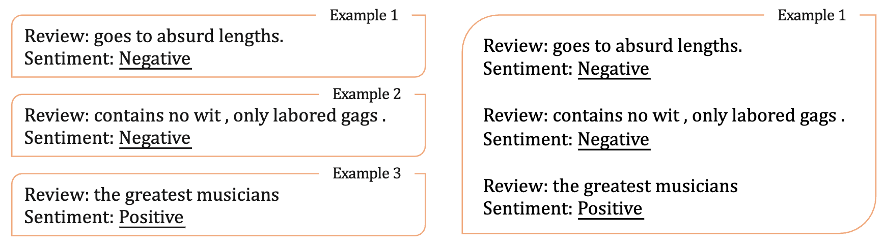

# In-context Learning Evaluation

We demonstrate the process of conducting in-context learning experiments with our TINT or other models for comparison. We support running experiments with following three modes, `standard`, `dynamic evaluation` and `TINT`. `TINT` effectively approximates `dynamical evaluation` with only forward passes with no backward pass. `standard` is simply the standard in-context learning setting.

We use `scripts/run_eval.sh` as our main script and you can pass arguments to the script to enable different types of evaluations.

```
bash scripts/run_eval.sh [ARGUMENTS]
```

We explain the arguments as follows:

`model_path`: path of the model, it could be a huggingface model path, e.g., `facebook/opt-125m`, or a TINT model.  
`model_name`: name of the model and can be freely decided by users, for logging purposes.  
`output_dir`: output directory.   
`train_num`: number of training examples for in-context learning, dynamic evaluation, or internal training for TINT. Supports both zero-shot (=0) and few-shot (>0) settings.
`task`: task name and currently supports `AmazonPolarity`, `YelpPolarity`, `AGNews`, `SST2`, `MR`, `CR`, `MPQA`, and `Subj`.   
`lr`: learning rate for training. We grid search a learning rate of 1e-3, 1e-4, 1e-5 and 1e-6 in our experiments.   
`train_set_seed`: seed for selecting training examples.   
`single_FT`: whether training with a concatenation of in-context learning examples or training with seperate examples in each input. Please find the image below for illustration.
`num_train_layers`: number of training layers (top layers). We experimented with 3, 6, 12 training layers.  
`label_type`: whether we use the loss of all the tokens in the context (`context`) or only use loss on the label words (`label_only`).   
`sfc_type`: whether or not to use the [surface form competition algorithm](https://arxiv.org/abs/2104.08315) to calibrate.   
    `plain`: we do not use any calibration method.   
    `icl_sfc`: we use the sfc algorithm for calibration.   
`eval_type`: `eval` or `test`, we use `eval` as the default setting.   
`template`: we use default template `0`, uses could define templates in `templates.py` and add it to the specific task in `tasks.py`.   
`test`: if `True`, the evaluation enters a test mode for debugging.   
`dynamic_eval`: `True` for `dynamic evaluation` and `TINT` mode, and `False` for `standard` mode.   



